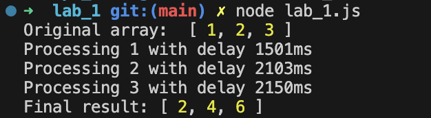
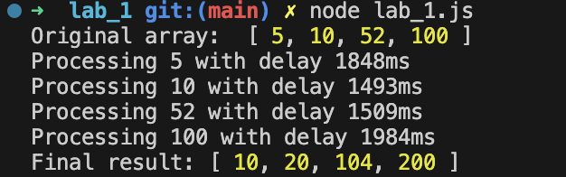
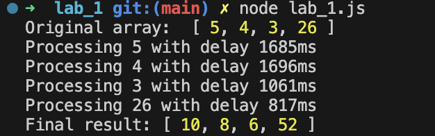

---
| [Main page](../) | [Task 1](../lab_1/) | [Task 2](../lab_2/) | [Task 3](../lab_3/) | [Task 4](../lab_4/) | [Task 5](../lab_5/) |
| --- | --- | --- | --- | --- | --- |
---

# Task 1
  * Choose array fn (map/filter/filterMap/some/find/findIndex)
  * Prepare its callback based async counterpart
  * Prepare demo cases for the usage

# JS code
```js
const asyncMap = (array, asyncCallback, finalCallback) => {
    const arrayLength = array.length;
    const mappedArray = [];
    let completed = 0;
    let hasError = false;

    for (let i = 0; i < arrayLength; i++) {
        asyncCallback(array[i], (err, result) => {
            if (err) {
                if (!hasError) {
                    hasError = true;
                    finalCallback(err, null);
                }
                return;
            }

            mappedArray[i] = result;
            completed++;

            if (completed === array.length && !hasError) {
                finalCallback(null, mappedArray);
            }
        });
    }
};

const asyncDouble = (value, cb) => {
    const delay = Math.floor(Math.random() * 2500) + 500;

    console.log(`Processing ${value} with delay ${delay}ms`);

    setTimeout(() => {
        if (typeof value !== 'number') {
            cb(new Error(`Invalid value: ${value}`));
        } else {
            cb(null, value * 2);
        }
    }, delay);
};

const numbers = [5, 4, 3, 'qwerty', 26];
console.log("Original array: ", numbers);


const finalCallback = (err, result) => {
    if (err) {
        console.error("Error:", err.message);
    } else {
        console.log("Final result:", result);
    }
};

asyncMap(numbers, asyncDouble, finalCallback);
```

# Testing program

### Test 1


### Test 2


### Test 3

