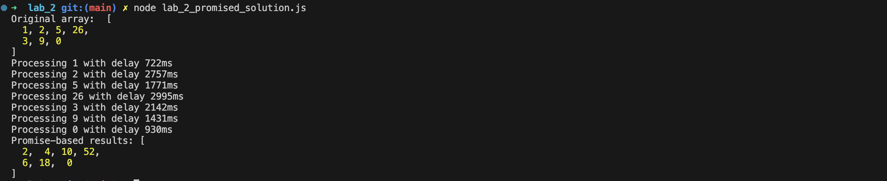
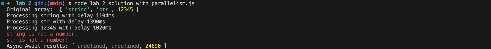

---
| [Main page](../) | [Task 1](../lab_1/) | [Task 2](../lab_2/) | [Task 3](../lab_3/) | [Task 4](../lab_4/) | [Task 5](../lab_5/) |
| --- | --- | --- | --- | --- | --- |
---

# Task 2
  * Prepare promise based alternative
  * Write use cases for the promise based solution
  * Write use cases for the async-await
  * Add new on-demend feature during review
    e.g.: Add support for parallelism


# Code for promise based solution
```javascript
const asyncMap = (array, asyncFunction) => {
    const arrayLength = array.length;
    const mappedArray = [];
    let completed = 0;

    

    return new Promise((resolve, reject) => {
        const actionAfterEachElement = () => {
            completed++;
            if (completed === arrayLength) {
                resolve(mappedArray);
            }
        }
        for (let i = 0; i < arrayLength; i++) {
            asyncFunction(array[i])
                .then(result => {
                    mappedArray[i] = result;
                    actionAfterEachElement()
                })
                .catch(err => {
                    console.error(err.message);
                    mappedArray[i] = undefined;
                    actionAfterEachElement()
                });
        }
    });
};

const asyncDouble = (value) => {
    return new Promise((resolve, reject) => {
        const delay = Math.floor(Math.random() * 2500) + 500;
        console.log(`Processing ${value} with delay ${delay}ms`);

        setTimeout(() => {
            if (typeof value !== 'number') {
                reject(new Error(`${value} is not a number!`));
            } else {
                resolve(value * 2);
            }
        }, delay);
    });
};


const numbers = [1, 2, 5, 'ogogog', 3, 9, 0];
console.log("Original array: ", numbers);

asyncMap(numbers, asyncDouble)
    .then(results => {
        console.log("Promise-based results:", results);
    })
    .catch(err => {
        console.error(err.message);
    });
```

# Testing program

### Test 1


### Test 2


# Code for async-await solution
```javascript
const asyncMap = async (array, asyncCallback) => {
    const mappedArray = [];
    for (let i = 0; i < array.length; i++) {
        try {
            const result = await asyncCallback(array[i]);
            mappedArray[i] = result;
        } catch (err) {
            console.error(err.message);
            mappedArray[i] = undefined;
        }
    }
    return mappedArray;
};

const asyncDouble = async (value) => {
    return new Promise((resolve, reject) => {
        const delay = Math.floor(Math.random() * 2500) + 500;
        console.log(`Processing ${value} with delay ${delay}ms`);
        setTimeout(() => {
            if (typeof value !== 'number') {
                reject(new Error(`${value} is not a number!`));
            } else {
                resolve(value * 2);
            }
        }, delay);
    });
};


const numbers = [1.1, 'qwerty', 26];
console.log("Original array: ", numbers);

async function runTask() {
    try {
        const results = await asyncMap(numbers, asyncDouble);
        console.log("Async-Await results:", results);
    } catch (err) {
        console.error(err.message);
    }
}

runTask();
```

# Testing program

### Test 1


### Test 2


### Test 3


# Code for "with parallelism"
```javascript
const asyncMap = async (array, asyncCallback) => {
    const mappedArray = [];
    const promises = array.map(async (item, index) => {
        try {
            const result = await asyncCallback(item);
            mappedArray[index] = result;
        } catch (err) {
            console.error(err.message);
            mappedArray[index] = undefined;
        }
    });
    await Promise.all(promises);
    return mappedArray;
};

const asyncDouble = async (value) => {
    return new Promise((resolve, reject) => {
        const delay = Math.floor(Math.random() * 2500) + 500;
        console.log(`Processing ${value} with delay ${delay}ms`);

        setTimeout(() => {
            if (typeof value !== 'number') {
                reject(new Error(`${value} is not a number!`));
            } else {
                resolve(value * 2);
            }
        }, delay);
    });
};

const numbers = ['string', 'str', 12345];
console.log("Original array: ", numbers);

async function runTask() {
    try {
        const results = await asyncMap(numbers, asyncDouble);
        console.log("Async-Await results:", results);
    } catch (err) {
        console.error(err.message);
    }
}

runTask();
```

# Testing program

### Test 1


### Test 2

