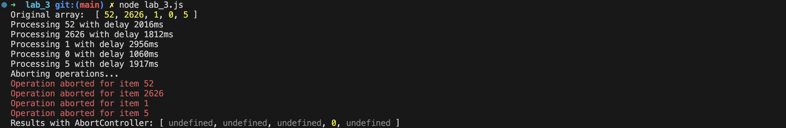
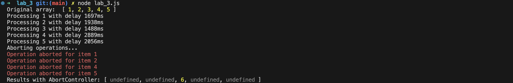

---
| [Main page](../) | [Task 1](../lab_1/) | [Task 2](../lab_2/) | [Task 3](../lab_3/) | [Task 4](../lab_4/) | [Task 5](../lab_5/) |
| --- | --- | --- | --- | --- | --- |
---

# Task 3
* Integrate AbortController or other Cancallable approach


# Code for solution with AbortController
```javascript
const asyncMap = (array, asyncFunction, signal) => {
    const arrayLength = array.length;
    const mappedArray = [];
    let completed = 0;
    let hasError = false;

    return new Promise((resolve, reject) => {
        const actionAfterEachElement = () => {
            completed++;
            if (completed === arrayLength && !hasError) {
                resolve(mappedArray);
            }
        };

        for (let i = 0; i < arrayLength; i++) {
            asyncFunction(array[i], signal)
                .then(result => {
                    mappedArray[i] = result;
                    actionAfterEachElement();
                })
                .catch(err => {
                    mappedArray[i] = undefined;
                    if (!hasError) {
                        hasError = true;
                        reject(err);
                    }
                    actionAfterEachElement();
                });
        }
    });
};

const asyncDouble = (value, signal) => {
    const abortHandler = (timeout, reject) => {
        clearTimeout(timeout);
        const abortError = new Error('AbortError');
        abortError.name = 'AbortError';
        reject(abortError);
    };

    let timeout;
    return new Promise((resolve, reject) => {
        const delay = Math.floor(Math.random() * 2500) + 500;
        console.log(`Processing ${value} with delay ${delay}ms`);

        timeout = setTimeout(() => {
            if (typeof value !== 'number') {
                reject(new Error(`${value} is not a number!`));
            } else {
                resolve(value * 2);
            }
        }, delay);

        if (signal) {
            signal.addEventListener('abort', () => abortHandler(timeout, reject));
        }
    }).finally(() => {
        console.log('Removing abort event listener.');
        signal.removeEventListener('abort', () => abortHandler(timeout, reject));
    });
};

const numbers = [1, 2, 5, 123, 3, 9, 0];
console.log("Original array: ", numbers);

async function processWithAbortController() {
    const controller = new AbortController();
    const signal = controller.signal;

    const abortTimeout = setTimeout(() => {
        console.log('Aborting operations...');
        controller.abort();
    }, 2000);

    try {
        const results = await asyncMap(numbers, asyncDouble, signal);
        console.log("Promise-based results:", results);
        clearTimeout(abortTimeout);
        return;
    } catch (err) {
        if (err.name === 'AbortError') {
            console.error('Processing was aborted.');
        } else {
            console.error(`Error: ${err.message}`);
        }
    }
}

processWithAbortController();
```

# Testing program

### Test 1


### Test 2


### Test 3
