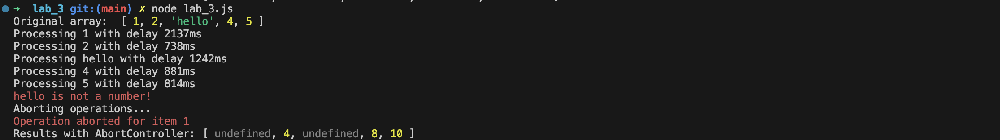

---
| [Main page](../) | [Task 1](../lab_1/) | [Task 2](../lab_2/) | [Task 3](../lab_3/) | [Task 4](../lab_4/) | [Task 5](../lab_5/) |
| --- | --- | --- | --- | --- | --- |
---

# Task 3
* Integrate AbortController or other Cancallable approach


# Code for solution with AbortController
```javascript
const asyncMap = async (array, asyncCallback, signal) => {
    const mappedArray = [];
    const promises = array.map(async (item, index) => {
        try {
            const result = await asyncCallback(item, signal);
            mappedArray[index] = result;
        } catch (err) {
            if (err.name === 'AbortError') {
                console.error(`Operation aborted for item ${item}`);
            } else {
                console.error(err);
            }
            mappedArray[index] = undefined;
        }
    });
    await Promise.all(promises);
    return mappedArray;
};

const asyncDouble = async (value, signal) => {
    const delay = Math.floor(Math.random() * 2500) + 500;
    console.log(`Processing ${value} with delay ${delay}ms`);

    return new Promise((resolve, reject) => {
        const timeout = setTimeout(() => {
            if (typeof value !== 'number') {
                reject(new Error('Input must be a number'));
            } else {
                resolve(value * 2);
            }
        }, delay);

        signal.addEventListener('abort', () => {
            clearTimeout(timeout);
            reject(new DOMException('Operation aborted', 'AbortError'));
        });
    });
};


const numbers = [1, 2, 'hello', 4, 5];
console.log("Original array: ", numbers);

async function processWithAbortController() {
    const controller = new AbortController();
    const signal = controller.signal;

    setTimeout(() => {
        console.log('Aborting operations...');
        controller.abort();
    }, 1500);

    try {
        const results = await asyncMap(numbers, asyncDouble, signal);
        console.log("Results with AbortController:", results);
    } catch (err) {
        console.error(err);
    }
}

processWithAbortController();
```

# Testing program

### Test 1


### Test 2


### Test 3
