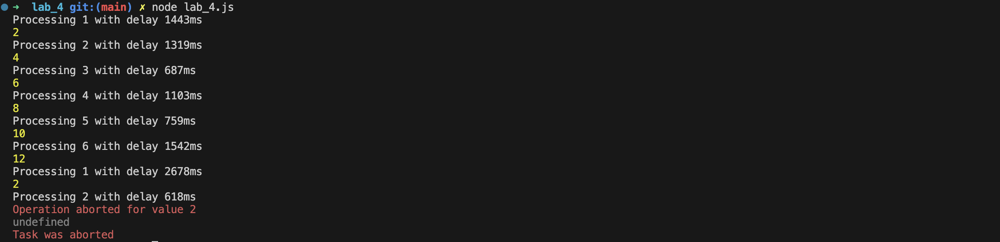
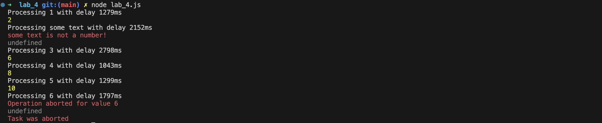
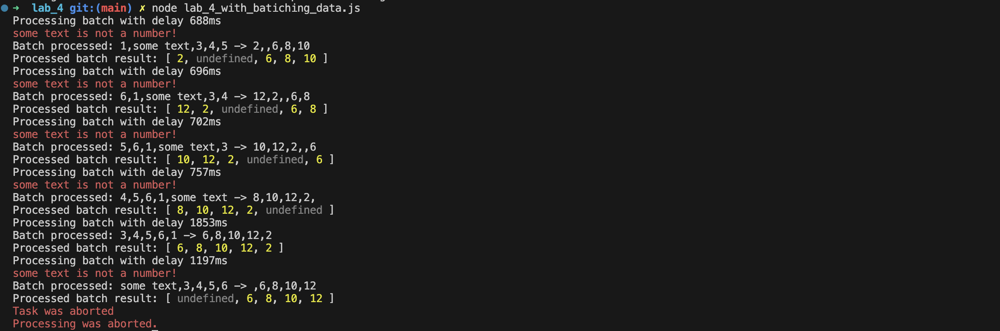

---
| [Main page](../) | [Task 1](../lab_1/) | [Task 2](../lab_2/) | [Task 3](../lab_3/) | [Task 4](../lab_4/) | [Task 5](../lab_5/) |
| --- | --- | --- | --- | --- | --- |
---

# Task 4 (Stream/AsyncIterator/Alternative)
  * Ongoing processing of large data sets that do not fit in memory


# Code for solution with async iterator
```javascript
const asyncMap = async function* (array, asyncCallback, signal) {

    for (const item of array) {
        if (signal.aborted) {
            throw new Error("Task was aborted");
        }

        try {
            const result = await asyncCallback(item, signal);
            yield result;  // возвращаем результат по мере готовности
        } catch (err) {
            console.error(err.message);
            yield undefined;  // в случае ошибки возвращаем "undefined"
        }
    }
};

const asyncDouble = async (value, signal) => {
    return new Promise((resolve, reject) => {
        const delay = Math.floor(Math.random() * 2500) + 500;
        console.log(`Processing ${value} with delay ${delay}ms`);

        const timeout = setTimeout(() => {
            if (typeof value !== 'number') {
                reject(new Error(`${value} is not a number!`));
            } else {
                resolve(value * 2);
            }
        }, delay);

        signal.addEventListener('abort', () => {
            clearTimeout(timeout);
            const abortError = new Error(`Operation aborted for value ${value}`)
            abortError.name = 'AbortError'
            reject(abortError);
        });
    });
};

const numbers = [1, 'some text', 3, 4, 5, 6];
const duplicatedArray = [];
for (let i = 0; i < 5000; i++) {
    duplicatedArray.push(...numbers);
}
// console.log("Original array: ", duplicatedArray);

async function runTask() {
    const abortController = new AbortController();
    const signal = abortController.signal;
    const timeout = setTimeout(() => abortController.abort(), 10000);

    try {
        for await (const result of asyncMap(duplicatedArray, asyncDouble, signal)) {
            console.log(result);
        }
    } catch (err) {
        if (err.name === 'AbortError') {
            console.error('Processing was aborted.');
        } else {
            console.error(err.message);
        }
    } finally {
        clearTimeout(timeout);
    }
}

runTask();
```

# Testing program

### Test 1


### Test 2



# Code for solution with batching by 5
```javascript
const asyncMapBatch = async function* (array, asyncCallback, signal, batchSize = 5) {
    for (let i = 0; i < array.length; i += batchSize) {
        if (signal.aborted) {
            console.error("Task was aborted");
            throw new Error("Task was aborted");
        }

        const batch = array.slice(i, i + batchSize);
        try {
            const results = await asyncCallback(batch);
            console.log(`Batch processed: ${batch} -> ${results}`);
            yield results;
        } catch (err) {
            console.error(`Error processing batch ${batch}: ${err.message}`);
            yield batch.map(() => undefined);
        }
    }
};

const asyncDoubleBatch = async (batch) => {
    const delay = Math.floor(Math.random() * 2000) + 100;
    console.log(`Processing batch with delay ${delay}ms`);
    return Promise.all(
        batch.map(item =>
            new Promise((resolve) => {
                

                setTimeout(() => {
                    if (typeof item !== 'number') {
                        console.error(`${item} is not a number!`);
                        resolve(undefined);
                    } else {
                        resolve(item * 2);
                    }
                }, delay);
            })
        )
    );
};

const numbers = [1, 'some text', 3, 4, 5, 6];
const duplicatedArray = [];
for (let i = 0; i < 5000; i++) {
    duplicatedArray.push(...numbers);
}

async function runTask() {
    const abortController = new AbortController();
    const signal = abortController.signal;

    const cancelTimeout = setTimeout(() => {
        abortController.abort();
    }, 5000);

    try {
        for await (const batchResult of asyncMapBatch(duplicatedArray, asyncDoubleBatch, signal, 5)) {
            console.log("Processed batch result:", batchResult);
        }
    } catch (err) {
        if (signal.aborted) {
            console.error("Processing was aborted.");
        } else {
            console.error(err.message);
        }
    } finally {
        clearTimeout(cancelTimeout);
    }
}

runTask();
```

# Testing program

### Test 1


