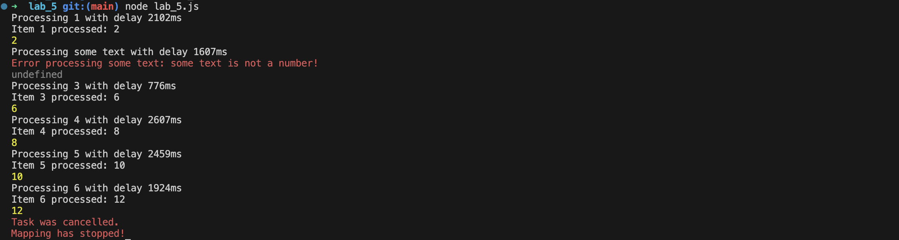
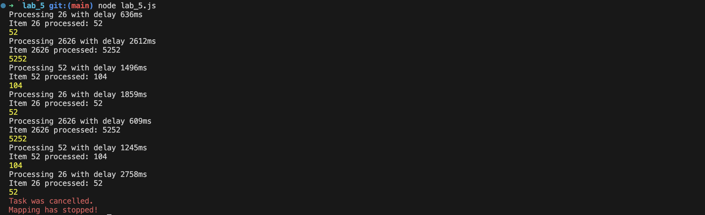

# Task 5 (Observable/EventEmitter/Alternative) 
   * Reactive message based communication between entities


# Code for solution with EventEmitter
```js
class EventEmitter {
    constructor() {
        this.listeners = {};
    }

   
    on(event, listener) {
        if (!this.listeners[event]) {
            this.listeners[event] = [];
        }
        this.listeners[event].push(listener);
    }

    emit(event, ...args) {
        if (this.listeners[event]) {
            this.listeners[event].forEach(listener => listener(...args));
        }
    }
}

const asyncMap = async function* (array, asyncCallback, emitter) {
    let cancel_mapping = false;

    emitter.on('cancel_mapping', () => {
        cancel_mapping = true;
    });

    for (const item of array) {
        if (cancel_mapping) {
            emitter.emit('task_cancelled');
            throw new Error("Mapping has stopped!");
        }

        try {
            const result = await asyncCallback(item);
            emitter.emit('item_processed', item, result);
            yield result;
        } catch (err) {
            emitter.emit('error', item, err);
            yield undefined;
        }
    }
};

const asyncDouble = async (value) => {
    return new Promise((resolve, reject) => {
        const delay = Math.floor(Math.random() * 2500) + 500;
        console.log(`Processing ${value} with delay ${delay}ms`);

        const timeout = setTimeout(() => {
            if (typeof value !== 'number') {
                reject(new Error(`${value} is not a number!`));
            } else {
                resolve(value * 2);
            }
        }, delay);

        emitter.on('cancel', () => {
            clearTimeout(timeout);
            reject(new Error(`Operation cancelled for value ${value}`));
        });
    });
};

const emitter = new EventEmitter();

emitter.on('item_processed', (item, result) => {
    console.log(`Item ${item} processed: ${result}`);
});

emitter.on('task_cancelled', () => {
    console.error('Task was cancelled.');
});

emitter.on('error', (item, error) => {
    console.error(`Error processing ${item}: ${error.message}`);
});

const numbers = [26, 2626, 52];
const duplicatedArray = [];
for (let i = 0; i < 5000; i++) {
    duplicatedArray.push(...numbers);
}

async function runTask() {
    const timeout = setTimeout(() => emitter.emit('cancel_mapping'), 10000);

    try {
        for await (const result of asyncMap(duplicatedArray, asyncDouble, emitter)) {
            console.log(result);
        }
    } catch (err) {
        console.error(err.message);
    } finally {
        clearTimeout(timeout);
    }
}

runTask();
```

# Testing program

### Test 1


### Test 2
